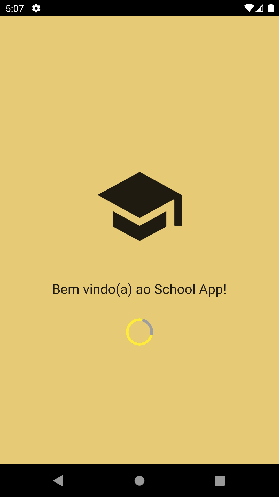
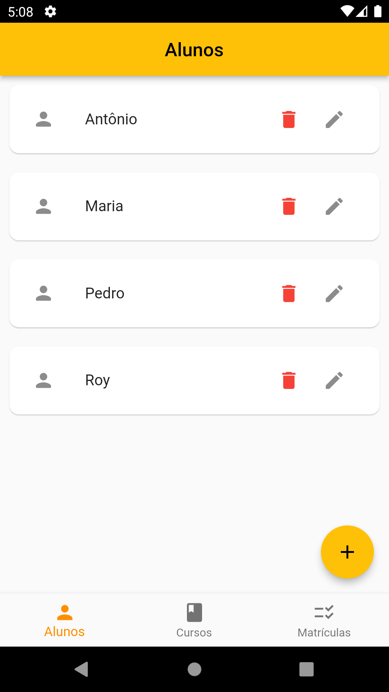
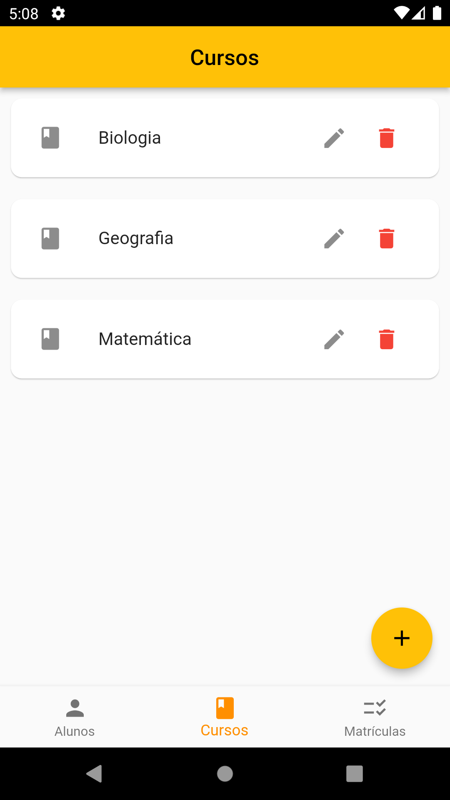
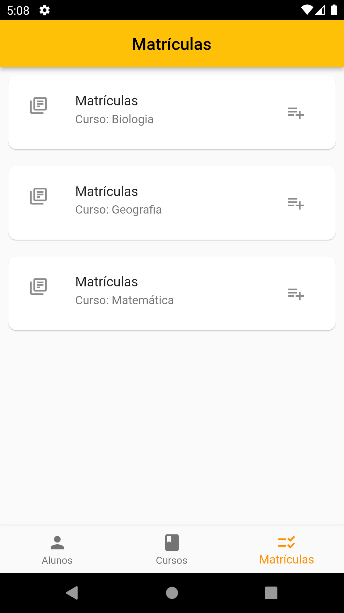

# school_app

O school_app é uma Aplicação Mobile para uma escola que foi desenvolvida utilizando Flutter SDK/Dart(Para o aplicativo móvel), Node.Js (Para a API) e PostgreSQL(Para o Banco de dados).

## Screenshots
Splash Screen              |  Tela inicial - Alunos
:-------------------------:|:-------------------------:
||

Tela inicial - Cursos      |  Tela inicial - Matrículas
:-------------------------:|:-------------------------:
||

## Versions
1. Flutter: 2.10.3
2. Android SDK: 32.0.0
3. Node.Js: v16.13.1
4. PostgreSQL: 14

## Executando a API
1. Você precisará instalar o [Node.js](https://nodejs.org/en/download/).
   1 - O projeto da API se encontra na pasta [api_school_app](api_school_app/)
   2 - Execute o comando "npm install" para instalar as dependências
   3 - Execute o comando "node index.js" para executar a API

## Observações
1. É importante observar que para a API se conectar corretamente com o banco de dados é preciso verificar se as configurações de conexões no arquivo [connection.js](api_school_app/connection.js) estão de acordo com as suas credênciais do banco de dados
2. Para que o aplicativo faça as requisições corretamente para a API é preciso verificar se as configurações de ambiente estão configuradas corretamente de acordo com o seu ambiente. O arquivo se encontra em [enviroments_details.dart](lib/app/enviroments_details/enviroments_details.dart)
3. O arquivo.sql do banco de dados do programa se encontra na pasta [bd_school_app](bd_school_app/school_app.sql)
